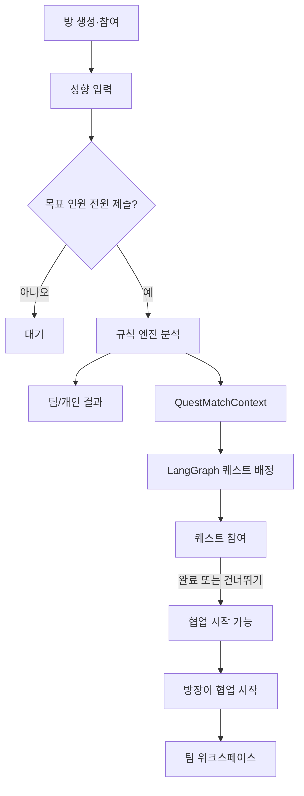
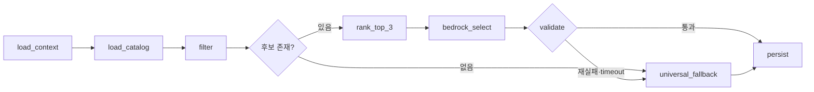

# 경진대회 팀 빌딩·퀘스트·협업 워크스페이스

- 문서 버전: 5.2
- 이전 버전: 5.1
- 기준 코드: `backend/app/services/chemistry/engine.py`, `backend/knowledge_base/team_rules.yaml`
- 퀘스트 계약: `quest.schema.json`, `quests.json`, `validate_quests.py`
- 팀 규모: 3~10명
- 기술: Next.js, FastAPI, LangChain, LangGraph, Amazon Bedrock, PostgreSQL 또는 SQLite

---

## 0. 핵심 결정

1. 제품은 팀을 평가하지 않고 첫 대화에서 실제 협업까지 연결한다.
2. 자체 4축 24문항 또는 자체 유형 직접 입력을 사용하며 공식 DiSC 검사로 표현하지 않는다.
3. 팀 분석은 백엔드의 단일 결정론적 엔진만 사용한다.
4. 퀘스트 배정을 위한 새 팀 유형 코드를 만들지 않는다.
5. 기존 엔진의 `matched_rule_ids`, `distribution`, `team_size`를 재사용한다.
6. 퀘스트의 `best_for/also_for/avoid_for`에는 자연어가 아닌 기존 `team_rules.yaml`의 `rule_id`를 저장한다.
7. 첫 만남·온라인 같은 상황은 `context_tags`로 분리한다.
8. LLM은 검수된 후보 중 하나와 소개 문구만 선택한다. 퀘스트와 완료 조건을 만들거나 바꾸지 않는다.
9. 완료 여부는 `completion_condition.checks`를 일반 코드가 확인한다.
10. 퀘스트는 `COMPLETED` 또는 `SKIPPED`로 끝난다. 실패·심사·코인·리더보드는 없다.
11. 퀘스트 종료 후 방장이 `협업 시작`을 누른다.
12. P0 워크스페이스는 공동 할 일과 공유 링크만 제공한다.
13. 투표·타이머·결정 기록·SSE·외부 연동은 후순위다.
14. Bedrock 실패 시 결정론적 폴백으로 전체 흐름을 완료한다.
15. 개인 결과와 내부 점수·등급은 공개하지 않는다.

---

## 1. 제품과 사용자 흐름

### 1.1 한 줄 정의

팀원이 협업 성향을 입력하면 팀 특징과 아이스브레이킹 퀘스트를 제공하고, 완료 후 공동 작업 공간으로 연결하는 경진대회 팀 빌딩 플랫폼이다.

```text
팀 방 참여
→ 설문 또는 유형 입력
→ 팀 공개 리포트 / 개인 카드
→ 팀 공용 퀘스트
→ 완료 또는 건너뛰기
→ 방장이 협업 시작
→ 공동 할 일 / 공유 링크
```

### 1.2 역할

| 역할 | 권한 |
| --- | --- |
| `ROOM_HOST` | 방 생성, 분석 실행, 퀘스트 완료·건너뛰기 확정, 협업 시작 |
| `TEAM_MEMBER` | 방 참여, 성향 입력, 퀘스트 응답, 워크스페이스 사용 |

관리자 심사 페이지는 만들지 않는다. 결과는 전문 심리검사·채용평가·성과 예측이 아니며 특정 유형을 우수·열등·문제로 표현하지 않는다.

### 1.3 상태 흐름



---

## 2. 성향 분석 정본

### 2.1 자체 4축

| 축 | 상위 | 하위 |
| --- | --- | --- |
| `planning` | `PLANNER` | `ADAPTER` |
| `agency` | `DRIVER` | `SUPPORTER` |
| `conflict` | `CONFRONTER` | `HARMONIZER` |
| `communication` | `DIRECT` | `TACTFUL` |

중립은 `NEUTRAL`이다. 설문은 축별 6문항을 계산해 `r > 0.60`이면 상위, `r < 0.40`이면 하위, 나머지는 중립으로 변환한다. 직접 입력은 포지션만 저장하고 가짜 연속 점수를 DB에 저장하지 않는다.

### 2.2 단일 엔진

- API는 `backend/app/services/chemistry/engine.py`만 호출한다.
- LLM·LangChain·LangGraph는 성향 계산에 참여하지 않는다.
- `team_grade`, `internal_index`, 주의 코드는 퀘스트 에이전트·공개 API·팀 프롬프트에서 제외한다.
- 분석식 교체 시 기존 fixture 회귀 테스트를 먼저 통과한다.

### 2.3 재사용할 기존 rule_id

```text
TEAM_BALANCED_AGENCY
TEAM_BALANCED_CONFLICT
TEAM_DIVERSE_COMMUNICATION
TEAM_PLANNING_STABILITY
TEAM_ADAPTABILITY
TEAM_DRIVER_ENERGY
TEAM_HARMONIZER_PRESENCE
TEAM_TACTFUL_COMMUNICATION
TEAM_DIRECT_CONCENTRATION
TEAM_PLANNING_OVERLOAD
TEAM_LOW_DRIVER
TEAM_CONFRONTER_MAJORITY
TEAM_SUPPORTER_MAJORITY
TEAM_ADAPTER_MAJORITY
```

이 코드는 기존 `team_rules.yaml`의 내부 식별자이며 사용자에게 표시하지 않는다.

---

## 3. 퀘스트 배정 입력

V5.1의 `PLANNING_MIXED`, `DRIVER_MAJORITY` 같은 새 코드 체계는 제거한다.

```python
class QuestMatchContext(BaseModel):
    room_id: str
    team_size: int
    matched_rule_ids: list[str]
    distribution: dict[str, dict[str, int]]
    context_tags: list[str] = []
    completed_quest_ids: list[str] = []
```

```json
{
  "room_id": "room-01",
  "team_size": 4,
  "matched_rule_ids": [
    "TEAM_BALANCED_AGENCY",
    "TEAM_DIVERSE_COMMUNICATION",
    "TEAM_ADAPTABILITY"
  ],
  "distribution": {
    "planning": {"PLANNER": 2, "ADAPTER": 2, "NEUTRAL": 0},
    "agency": {"DRIVER": 3, "SUPPORTER": 1, "NEUTRAL": 0}
  },
  "context_tags": ["FIRST_MEETING", "HACKATHON"],
  "completed_quest_ids": []
}
```

허용 상황 태그:

```text
FIRST_MEETING, REMOTE_TEAM, IN_PERSON, HACKATHON,
LONG_TERM_PROJECT, BEFORE_ROLE_ASSIGNMENT, WORKSPACE_NOT_READY
```

P0에서는 `FIRST_MEETING`, `HACKATHON`을 기본값으로 사용할 수 있다.

---

## 4. 퀘스트 카탈로그 계약

### 4.1 정본과 모델

JSON 구조는 수정 중인 `quest.schema.json`, 데이터는 `quests.json`, 검증은 `validate_quests.py`를 정본으로 한다.

```python
class QuestTemplate(BaseModel):
    quest_id: str
    title: str
    summary: str
    category: str
    primary_goal: str
    duration_minutes: int
    team_size: dict                 # {"min": 3, "max": 10}
    interaction_mode: str           # 현재 schema enum 사용
    energy_level: Literal["LOW", "MEDIUM", "HIGH"]
    disclosure_level: Literal["LOW", "MEDIUM", "HIGH"]
    assignment: Literal["AUTO", "MANUAL"]
    reveals_axes: list[dict]
    is_universal: bool
    best_for: list[str]             # 기존 rule_id만
    also_for: list[str]             # 기존 rule_id만
    avoid_for: list[str]            # 기존 rule_id만
    context_tags: list[str]
    materials: list[str] = []
    steps: list[str]
    deliverable: str
    completion_condition: dict      # description + checks
    safety_notes: list[str]
    is_active: bool = True
    version: str
```

### 4.2 태그 예시

```json
{
  "best_for": ["TEAM_BALANCED_AGENCY"],
  "also_for": ["TEAM_ADAPTABILITY"],
  "avoid_for": ["TEAM_LOW_DRIVER"],
  "context_tags": ["FIRST_MEETING", "BEFORE_ROLE_ASSIGNMENT"]
}
```

자연어인 `"처음 만나 작업 방식을 모르는 팀"`은 `best_for`에 넣지 않고 `context_tags` 또는 `summary`로 이동한다.

### 4.3 범용·완료 규칙

- 범용 여부는 `UNIVERSAL` 문자열이 아닌 `is_universal` boolean으로 표현한다.
- `is_universal == true`이면 `avoid_for`는 빈 배열이다.
- `best_for/also_for/avoid_for`는 실제 `team_rules.yaml`의 ID 또는 빈 배열이어야 한다.
- `reveals_axes`는 활동 설명용이며 성향을 재판정하거나 배정 점수에 쓰지 않는다.
- 완료는 자연어 해석이 아닌 구조화 체크로 확인한다.

```json
{
  "description": "팀원 각자가 투표를 1회 완료한다.",
  "checks": [
    {"type": "VOTE", "scope": "PER_MEMBER", "min_count": 1}
  ]
}
```

P0에서는 `PER_MEMBER`, `TEAM`만 사용한다. 역할별 예외가 필요한 퀘스트는 모든 팀원이 별도 입력을 남기도록 고치거나 P1로 미룬다.

### 4.4 품질 조건

- 인원 범위는 3~10명이다.
- 9~10명 자동 퀘스트가 최소 4개 있어야 한다.
- 자동 후보는 `is_active == true`, `assignment == AUTO`, 공개 수준 `LOW|MEDIUM`이다.
- `HIGH` 퀘스트는 반드시 `MANUAL`이다.
- 모든 퀘스트에 `PER_MEMBER` 체크가 최소 하나 있어야 한다.
- 개인 경험·실명·과거 팀원 비난·밤샘을 요구하지 않는다.

### 4.5 현재 8개 퀘스트 보정

| 퀘스트 | 조치 |
| --- | --- |
| 공통점 다섯 개 | 유지, 가능하면 10명 지원, rule/context 태그 분리 |
| 업무 스타일 밸런스 게임 | 대표 퀘스트로 유지, rule_id 태깅 |
| 설명 전달 릴레이 | 설명자도 회고 한 줄을 제출해 `PER_MEMBER` 조건과 일치 |
| 세이브포인트 | 유지, 해커톤용 집중·응답 구간 문구 검토 |
| 그라운드 룰 세 문장 | 입력 부담이 커 P1 또는 낮은 우선순위 |
| 팀 공식 리액션 | `is_universal: true`, 기본 폴백 |
| 가상 타임라인 | 유지, 9~10명 시간 조정 |
| 공동 작업 공간 세팅 | 협업 시작 직전 우선, 링크 확인 단순화 |

---

## 5. 퀘스트 배정 에이전트

### 5.1 역할 분리

일반 코드가 활성 여부·인원·공개 수준·회피 태그·중복을 필터하고 점수를 계산한다. Bedrock은 상위 허용 후보 중 하나, 중립적인 이유, 시작 소개 한 문장만 생성한다.

```text
best_for 일치       +3
also_for 일치       +1
context_tags 일치   +1
is_universal        +1
같은 category 반복  -2

avoid_for 일치, 인원 불일치, HIGH, MANUAL, 비활성 → 제외
```

상위 최대 3개만 Bedrock에 전달한다. 후보가 하나면 Bedrock을 생략할 수 있다.

### 5.2 LangGraph



```python
class QuestAssignmentDecision(BaseModel):
    quest_id: str
    reason: str
    intro_message: str
    used_rule_ids: list[str]
    assignment_source: Literal["AGENT", "FALLBACK"]
```

검증 조건:

- `quest_id`는 전달한 후보에 존재한다.
- `used_rule_ids`는 입력 `matched_rule_ids`의 부분집합이다.
- 이유와 소개에 점수·등급·우열·성공 예측이 없다.
- 출력에 퀘스트 본문·단계·완료 조건을 넣지 않는다.

폴백 정렬:

```text
candidate_score DESC → is_universal DESC → disclosure ASC
→ duration ASC → quest_id ASC
```

후보가 전혀 없으면 범용 `팀 공식 리액션`을 제공한다.

---

## 6. 퀘스트 상태와 협업 시작

```text
ASSIGNED → IN_PROGRESS → COMPLETED
                       → SKIPPED
```

- 결과물의 품질은 평가하지 않는다.
- 완료 시 서버가 체크 충족 여부를 다시 확인한다.
- 건너뛰기는 불이익 정보를 만들지 않는다.
- 팀당 활성 배정은 최대 하나이며 배정 API는 멱등이다.
- 완료와 건너뛰기가 동시에 오면 먼저 확정된 종료 상태만 인정한다.
- 분석 완료 + 퀘스트 종료 + 방장 요청일 때만 워크스페이스를 시작한다.
- 협업 시작 API도 중복 요청에 같은 워크스페이스를 반환한다.

---

## 7. P0 협업 워크스페이스

### 공동 할 일

```text
TODO → IN_PROGRESS → DONE
```

생성·수정·삭제, 담당자, 선택형 마감 시간, 생성자·수정 시각을 제공한다. 드래그 앤 드롭 대신 상태 버튼을 사용한다.

### 공유 링크

```text
GITHUB, FIGMA, NOTION, GOOGLE_DRIVE, DEPLOYMENT, OTHER
```

P0에서는 URL 등록과 새 창 열기만 제공한다. 화면은 3~5초 polling으로 서버 상태를 다시 조회한다.

P1은 빠른 투표·타이머·결정 기록·SSE·협업 현황 요약이다. P2는 GitHub·Calendar·MCP 연동이며 외부 쓰기 전 사용자 확인이 필수다.

---

## 8. 데이터와 API

### 8.1 P0 엔터티

```text
TeamRoom(id, expected_team_size, invite_code_hash, host_participant_id,
         analysis_status, workspace_status)
Participant(id, room_id, nickname, participant_secret_hash, submission_status)
ParticipantProfile(participant_id, source, answers_json, positions_json, ratios_json)
TeamAnalysis(room_id, distribution_json, matched_rule_ids_json,
             public_report_json, prompt_version, model_id, used_fallback)
QuestTemplate(quest_id, payload_json, version, is_active)
QuestAssignment(room_id, quest_template_id, status, assignment_source,
                reason, intro_message, used_rule_ids_json, result_json)
Workspace(id, room_id, status, started_at)
WorkspaceTask(workspace_id, title, status, assignee_participant_id, due_at)
ResourceLink(workspace_id, title, url, provider, created_by)
```

초대 코드 하나가 한 팀이므로 `CompetitionRoom + Team`을 `TeamRoom`으로 단순화한다.

### 8.2 주요 API

```text
POST /api/rooms
POST /api/rooms/{invite_code}/participants
POST /api/participants/{id}/submissions/survey
POST /api/participants/{id}/submissions/type
POST /api/rooms/{id}/analysis                    # 방장
GET  /api/rooms/{id}/results/team
GET  /api/rooms/{id}/results/me                  # 본인

GET  /api/rooms/{id}/quests/current
POST /api/rooms/{id}/quests/assign               # 방장, 멱등
PUT  /api/quest-assignments/{id}/responses/me    # 본인
PUT  /api/quest-assignments/{id}/result          # 방장
POST /api/quest-assignments/{id}/complete        # 방장
POST /api/quest-assignments/{id}/skip            # 방장

POST /api/rooms/{id}/workspace/start             # 방장, 멱등
GET  /api/workspaces/{id}
POST /api/workspaces/{id}/tasks
PATCH/DELETE /api/tasks/{id}
POST /api/workspaces/{id}/resources
DELETE /api/resources/{id}
```

참여자 secret은 HttpOnly 쿠키 또는 Authorization 헤더로 전달한다. 서버가 방장·본인·같은 방 권한을 다시 확인한다.

---

## 9. 프론트 계약

팀 결과:

```text
team_comment.title, formula, scene, keywords
```

개인 결과:

```text
insight.card_title, contribution, optional_try
```

퀘스트:

```text
quest_id, title, summary, duration_minutes, steps, materials, deliverable,
assignment.reason, assignment.intro_message, assignment.status,
my_response_status, team_completion_status
```

`used_rule_ids`, 내부 점수·등급, 설문 원문, 다른 팀원의 개인 카드는 표시하지 않는다. 완료·건너뛰기·협업 시작 버튼은 방장에게만 표시하며 서버도 권한을 확인한다.

---

## 10. 테스트와 인수 기준

### 카탈로그

- 모든 퀘스트가 JSON Schema를 통과한다.
- 세 적합 필드가 실제 `team_rules.yaml` ID 또는 빈 배열이다.
- 자연어 적합 조건과 미허용 context tag를 차단한다.
- 9~10명 자동 퀘스트가 최소 4개다.
- `HIGH + AUTO`와 범용 퀘스트의 비어 있지 않은 `avoid_for`를 차단한다.

### 배정

- 비활성·인원 불일치·MANUAL·HIGH·회피·완료 후보를 제외한다.
- 후보 밖 LLM ID와 허용되지 않은 rule ID를 차단한다.
- timeout·파싱 실패에서 결정론적 폴백이 작동한다.
- 후보가 없으면 범용 기본 퀘스트를 반환한다.

### 상태·권한

- 완료 체크가 부족하면 완료되지 않는다.
- 팀당 활성 퀘스트가 하나만 존재한다.
- 배정과 협업 시작은 멱등이다.
- 일반 팀원은 방장 전용 API를 호출할 수 없다.
- 다른 방 사용자는 결과와 워크스페이스를 조회할 수 없다.

### 시연 인수 기준

```text
4명 참여 → 전원 입력 → 팀/개인 결과 → 퀘스트 배정
→ 전원 응답 → 방장 완료 → 협업 시작
→ 공동 할 일 생성 → 공유 링크 등록
```

Bedrock을 실패시킨 경우에도 같은 시연 흐름이 폴백으로 끝까지 동작해야 한다.

---

## 11. 역할별 P0 작업

### AI

- `QuestMatchContext` DTO·빌더 계약
- 후보 필터·점수·폴백
- LangGraph Bedrock 선택·구조화 검증
- 배정 Harness와 기존 코멘트 회귀 테스트

### 데이터

- 수정된 스키마와 퀘스트 JSON
- 자연어 적합 조건을 기존 rule ID와 context tag로 분리
- `is_active`, `version`, 인원·안전·완료 조건 검수
- 9~10명 대응 자동 퀘스트 최소 4개

### 백엔드

- 방·권한·분석과 퀘스트 저장 API
- 완료 체크, 활성 배정 제약, 멱등성
- 협업 시작·할 일·링크 API
- 서비스 레이어에서 AI 배정 함수 호출

### 프론트엔드

- 참여·설문·결과·퀘스트 화면
- 팀원별 응답 상태와 방장 전용 버튼
- 공동 할 일·공유 링크
- polling 기반 동기화

---

## 12. 구현 순서

1. 기존 분석·코멘트 회귀 테스트 고정
2. 수정된 스키마와 퀘스트 검증
3. `QuestMatchContext` 구현
4. 필터·점수·폴백 구현
5. LangGraph Bedrock 선택·검증 구현
6. QuestAssignment와 퀘스트 API 연결
7. 퀘스트 UI와 완료·건너뛰기 연결
8. 방장용 협업 시작 연결
9. 공동 할 일과 공유 링크 구현
10. 3~10명 fixture와 EC2 Bedrock 실호출 검증

---

## 13. V5.1 대비 변경점

1. 새 TeamQuestProfile 코드 체계를 제거했다.
2. 기존 `team_rules.yaml`의 `matched_rule_ids`를 재사용한다.
3. 자연어 상황을 `context_tags`로 분리했다.
4. QuestTemplate을 실제 퀘스트 스키마 구조에 맞췄다.
5. `UNIVERSAL` 문자열 대신 `is_universal`을 사용한다.
6. 완료 조건을 `completion_condition.checks`로 통일했다.
7. 방장만 완료·건너뛰기·협업 시작을 확정한다.
8. 활성 퀘스트 하나와 배정·협업 시작 멱등성을 명시했다.
9. `CompetitionRoom + Team`을 `TeamRoom`으로 단순화했다.
10. P0 워크스페이스를 공동 할 일과 공유 링크로 줄였다.
11. 투표·타이머·결정 기록·SSE를 P1로 이동했다.
12. AI는 소개 문구를 생성하지만 퀘스트 내용과 조건은 바꾸지 않는다.
