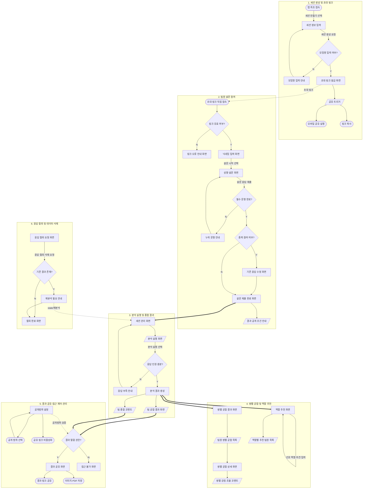
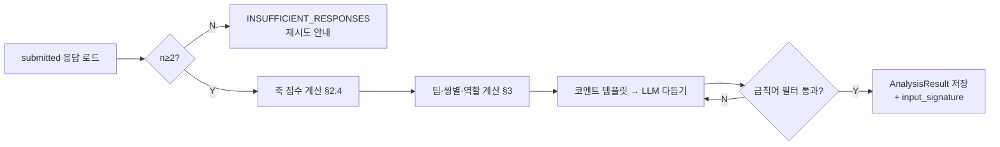
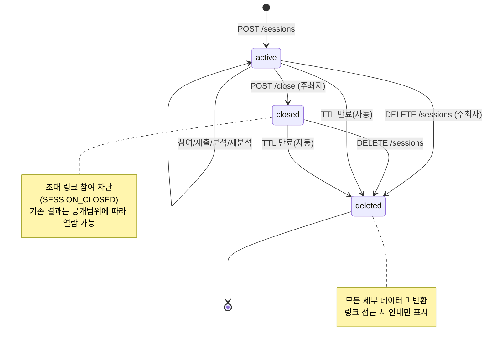
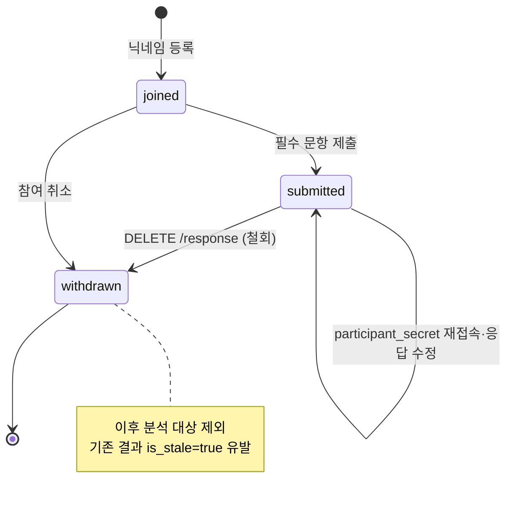
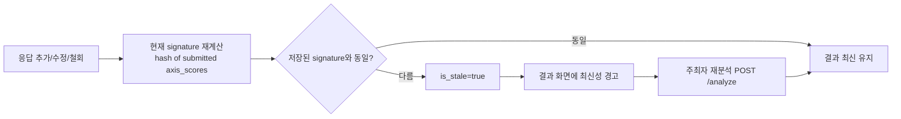
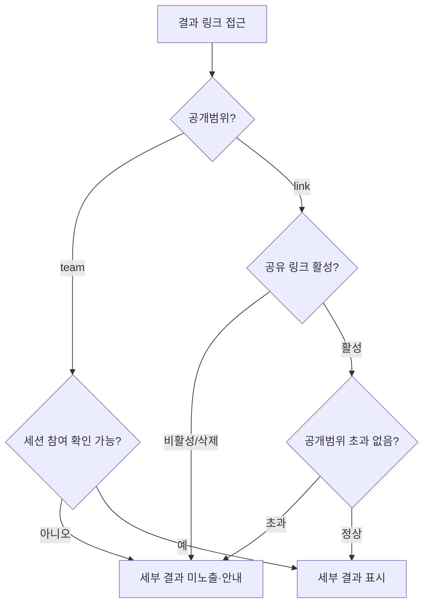
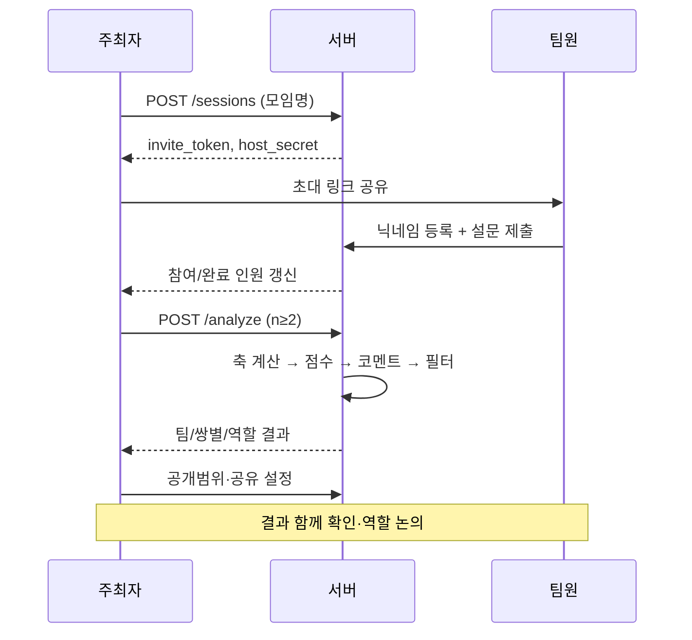

# 팀 성향 기반 모임 궁합 분석기 — 상세 설계 명세서

- 문서 버전: 1.0
- 기준 문서: `팀 성향 기반 모임 궁합 분석기_기능명세서_2026-08-27.xlsx`
- 작성일: 2026-08-27
- 목적: 원본 기능명세서(무엇을 하는가)를 구현 가능한 수준의 상세 설계(어떻게 하는가)로 확장한다. 성향 설문 모델, 궁합 점수 알고리즘, 데이터 모델, API, 아키텍처, 비기능 요구사항을 포함한다.

---

## 0. 문서 사용 안내

이 명세는 원본 8개 기능 요구사항을 그대로 상위 계약(contract)으로 유지하되, 다음을 새로 정의한다.

| 영역 | 원본 문서 | 본 문서 |
| --- | --- | --- |
| 제품 목표/시나리오/지표 | 개괄 | §1 (구체화) |
| 성향 설문 문항/척도 | 미정의 | §2 (신규) |
| 궁합 점수 계산식 | "계산한다"만 언급 | §3 (신규) |
| 데이터 모델 | 항목명만 언급 | §4 (신규) |
| API/엔드포인트 | 미정의 | §5 (신규) |
| 아키텍처/기술 스택 | 미정의 | §6 (신규) |
| 비기능(보안/성능/개인정보) | 리스크로만 언급 | §7 (신규) |
| 기능별 인수기준/엣지케이스 | ○ 항목 수준 | §8 (구체화) |

---

## 1. 프로덕트 요구사항 (PRD)

### 1.1 한 줄 정의
처음 만난 사람들이 짧은 성향 설문에 응답하면, 팀 케미 점수·팀원 간 궁합·추천 역할·협업 코멘트를 즉시 제공하여 자연스러운 팀 구성을 돕는 모바일 웹 서비스.

### 1.2 제품 목표 (측정 가능한 형태로 재정의)
- 해커톤/워크숍 등 단기 협업 상황에서 팀 편성 후 5분 이내에 "대화 시작점"을 제공한다.
- 회원가입 없이 초대 링크만으로 참여 가능(참여 마찰 최소화).
- 결과는 진단이 아닌 오락·협업 참고용으로 명확히 프레이밍한다.

### 1.3 페르소나
| 페르소나 | 역할 | 목표 | 좌절 지점 |
| --- | --- | --- | --- |
| 주최자 지훈 (32) | 모임 주최자 | 팀 편성을 빠르게, 어색함 없이 | 회원가입 요구, 느린 응답 수집 |
| 참가자 서연 (27) | 팀원 | 내게 맞는 역할을 재미있게 확인 | 긴 설문, 개인정보 노출 우려 |
| 운영자 (내부) | 관리자 | 데이터 최소 수집·자동 삭제 관리 | 낙인·편견 유발 표현 리스크 |

### 1.4 핵심 사용자 시나리오 (원본 7단계 유지)
세션 생성 → 초대 링크 공유 → 팀원 닉네임 입력 및 설문 → 응답 수집 → 분석 실행 → 결과(팀 점수/쌍별/역할) 확인 및 논의 → 결과 공유·저장.

### 1.5 핵심 지표 (KPI)와 초기 목표
| 지표 | 정의 | 초기 목표 |
| --- | --- | --- |
| 초대 링크 참여율 | 링크 방문자 대비 설문 시작 | ≥ 70% |
| 설문 완료율 | 시작 대비 제출 완료 | ≥ 85% |
| 세션당 평균 응답 인원 | 완료자 수 / 세션 | ≥ 4명 |
| 분석 결과 생성 성공률 | 분석 실행 대비 성공 | ≥ 98% |
| 결과 만족도 | 결과 페이지 평점(5점) | ≥ 4.0 |
| 재사용률 | 30일 내 재세션 생성 주최자 비율 | 관찰 지표 |

### 1.6 리스크와 완화책 (원본 리스크 → 설계 반영)
| 리스크 | 완화 설계 | 반영 위치 |
| --- | --- | --- |
| 결과를 능력/성격 판정으로 오해 | 모든 결과 화면에 "오락·협업 참고용" 고정 배너 | §8-F3/F4/F5 |
| 낮은 궁합 점수로 배제·낙인 | 점수를 "조율 방법 중심" 코멘트로만 노출, 극단 표현 금지 | §3.5, §8-F4 |
| 장난 응답·중도 이탈로 신뢰도 저하 | 응답 일관성 검사(§3.6), 최소 응답 인원 게이트(§3.1) | §3 |
| 개인정보/민감정보 관리 | 데이터 최소 수집, TTL 자동 삭제, 참여자 철회권 | §7.2, §8-F8 |
| 소규모 팀에서 개인 노출 과다 | n<3 쌍별 비공개 처리, 익명 집계 우선 | §8-F4 |
| 역할 추천의 성별·직무 편견 강화 | 역할 추천에서 인구통계 미수집, 성향 축만 사용 | §2, §3.4 |

### 1.7 범위 밖 (Out of scope)
회원 계정 시스템, 조직 관리자 대시보드, 실시간 채팅, 정식 심리검사 인증, 결제.

---

## 2. 성향 설문 모델 (신규 설계)

원본은 "협업 및 의사소통 성향" 설문이라고만 명시한다. 아래는 구현 가능한 설문 모델이다.

### 2.1 설계 원칙
- 모바일에서 60~90초 내 완료 (문항 12개 이하).
- 심리 진단이 아닌 협업 스타일 자기보고. MBTI/빅파이브 상표 표현 미사용.
- 각 문항은 5점 리커트(1=전혀 아니다 ~ 5=매우 그렇다) 또는 양극 선택.

### 2.2 성향 축 (Dimensions)
협업 맥락에 특화된 5개 축을 사용한다. 각 축은 -1.0 ~ +1.0으로 정규화한다.

| 코드 | 축 이름 | 한쪽 극(-) | 반대 극(+) |
| --- | --- | --- | --- |
| PACE | 업무 진행 속도 | 신중·계획형 | 빠른 실행·즉흥형 |
| COMM | 의사소통 방식 | 경청·비동기 선호 | 발산·즉시 토론 선호 |
| DECIDE | 의사결정 방식 | 데이터·합의 기반 | 직관·주도 결정 |
| FOCUS | 관심 초점 | 디테일·품질 | 큰 그림·속도 |
| SOCIAL | 팀 내 에너지 | 개별 몰입 선호 | 협업·상호작용 선호 |

### 2.3 문항 세트 (10문항, 축당 2문항)
각 문항은 특정 축에 매핑되며, 역채점(reverse) 여부를 가진다.

| # | 문항(요지) | 축 | 방향 |
| --- | --- | --- | --- |
| Q1 | 일을 시작하기 전 계획을 충분히 세운다 | PACE | - (reverse) |
| Q2 | 완벽하지 않아도 일단 빠르게 착수한다 | PACE | + |
| Q3 | 논의는 글보다 직접 말로 하는 게 편하다 | COMM | + |
| Q4 | 내 의견은 정리해서 필요한 때만 말한다 | COMM | - (reverse) |
| Q5 | 결정은 근거·데이터가 충분해야 내린다 | DECIDE | - (reverse) |
| Q6 | 상황 판단이 서면 빠르게 결정을 주도한다 | DECIDE | + |
| Q7 | 디테일과 품질을 끝까지 챙기는 편이다 | FOCUS | - (reverse) |
| Q8 | 세부보다 방향·핵심 결과에 집중한다 | FOCUS | + |
| Q9 | 여럿이 같이 할 때 에너지가 오른다 | SOCIAL | + |
| Q10 | 혼자 몰입할 때 성과가 잘 난다 | SOCIAL | - (reverse) |

### 2.4 축 점수 산출
리커트 응답 `r ∈ {1..5}` 를 `-1..+1` 로 매핑: `v = (r - 3) / 2`. 역채점 문항은 `v = -v`.
축 점수: 해당 축 문항 값의 평균.
```
axis_score(d) = mean( v_i for i in questions(d) )   # 범위 [-1, 1]
```

### 2.5 선택 입력: 선호 역할 (Feature 5 연계)
설문 마지막에 선택형으로 "선호 역할(복수 선택 가능)"을 받는다. 역할 추천 알고리즘에 가중치로 반영한다(§3.4). 미입력 허용.

---

## 3. 궁합 점수 알고리즘 (신규 설계)

### 3.1 최소 응답 게이트
- 팀 종합 분석: 완료 응답 `n ≥ 2` 필요 (권장 `n ≥ 3`).
- 쌍별 분석: `n ≥ 2`.
- `n < 2`이면 분석 미실행 + 사유 안내(원본 F3/F4 예외 요구).

### 3.2 축별 팀 프로파일
각 축 `d`에 대해 팀 평균 `mean_d`와 표준편차 `sd_d`를 계산한다.
- 낮은 `sd_d` = 해당 축에서 팀이 유사(마찰↓, 다양성↓).
- 높은 `sd_d` = 상호 보완 가능성↑, 조율 필요↑.

### 3.3 팀 종합 궁합 점수 (0~100)
축별로 "적정 다양성"을 보상하는 모델. 너무 균일하거나 너무 극단적으로 갈리면 감점.

```
# 각 축 다양성 점수 (표준편차 sd_d, 이론적 최대 sd_max = 1.0)
diversity_d = 1 - | sd_d - SD_TARGET_d |   # SD_TARGET_d: 축별 이상적 분산(기본 0.5)
diversity_d = clamp(diversity_d, 0, 1)

# 협업 마찰 위험 축(COMM, DECIDE, PACE)은 과다 분산 시 추가 감점
friction_penalty = w_f * sum( max(0, sd_d - 0.7) for d in {COMM, DECIDE, PACE} )

team_raw = mean_over_axes(diversity_d) - friction_penalty
team_score = round( clamp(team_raw, 0, 1) * 100 )
```
- `SD_TARGET_d`, `w_f`는 튜닝 상수(설정으로 분리). 기본 `SD_TARGET=0.5`, `w_f=0.15`.
- 점수는 등급으로도 노출: 90+ 환상의 케미 / 75+ 좋은 팀워크 / 60+ 조율하면 시너지 / <60 서로 알아가기 필요.

### 3.4 쌍별 궁합 점수 (0~100)
두 참여자 `a,b`의 축 벡터 거리 기반. 축마다 "유사가 좋은 축"과 "보완이 좋은 축"을 구분.

```
# 유사 선호 축: FOCUS, SOCIAL — 가까울수록 +
sim = mean( 1 - |a_d - b_d| / 2 for d in {FOCUS, SOCIAL} )
# 보완 선호 축: PACE, DECIDE — 적당한 차이가 +, 정반대는 조율 필요
comp = mean( comp_curve(|a_d - b_d|) for d in {PACE, DECIDE} )
# 의사소통 축: 중간 정도 차이 최적
communication = comm_curve(|a_COMM - b_COMM|)

pair_raw = 0.4*sim + 0.4*comp + 0.2*communication
pair_score = round( clamp(pair_raw, 0, 1) * 100 )
```
- `comp_curve(x)`: x=0 → 0.6, x≈1.0 → 1.0(피크), x=2.0 → 0.4 인 상향 후 완만 하강 곡선.
- `comm_curve(x)`: x≈0.5~1.0에서 피크인 종 모양.
- 각 쌍마다 강점 코멘트 1개 이상 + 조율점 코멘트 1개 이상 생성(§3.5).

### 3.5 코멘트 생성 규칙
- 규칙 기반 템플릿(1차) + 선택적 LLM 문구 다듬기(2차, §6).
- 낮은 점수라도 "갈등 확정" 표현 금지. 반드시 조율 행동을 제시.
  - 예) 나쁨: "두 분은 잘 안 맞습니다." → 좋음: "결정 속도가 달라요. 스프린트마다 결정 기한을 함께 정해보세요."
- 금칙어/표현 필터: 비하·단정·능력판정·성별직무 고정관념 표현 차단.

### 3.6 응답 신뢰도(장난 응답 완화)
- 역채점 문항 쌍의 응답 일관성 검사: 정합성 점수가 임계 미만이면 "응답 편차 큼" 플래그(분석은 진행하되 결과에 신뢰도 낮음 표시 가능).
- 동일 값 일괄 응답(전부 3점 등) 탐지 시 낮은 신뢰도 플래그.

### 3.7 역할 추천 알고리즘 (Feature 5)
사전 정의 역할 6종: 기획, 개발, 디자인, 발표, 일정 관리, 자료 조사.
각 역할은 축 선호 프로파일을 가진다(예시).

| 역할 | 선호 성향 프로파일(요지) |
| --- | --- |
| 기획 | FOCUS(+큰그림), DECIDE(합의/데이터), COMM(토론) |
| 개발 | FOCUS(디테일), PACE(계획~중립), SOCIAL(개별몰입) |
| 디자인 | FOCUS(디테일/품질), COMM(중립) |
| 발표 | COMM(발산), SOCIAL(협업), DECIDE(주도) |
| 일정 관리 | PACE(계획), DECIDE(데이터), FOCUS(디테일) |
| 자료 조사 | FOCUS(디테일), PACE(신중), SOCIAL(개별) |

```
fit(person, role) = cosine_or_weighted_match(person.axes, role.profile)
# 선호 역할 입력 시 fit += PREF_BONUS (기본 0.1)
```
- 역할별 상위 적합 팀원 추천 + 추천 이유(어떤 축이 기여했는지).
- 균형 제약: 한 사람이 과반 역할 1순위를 독점하면 재분배 안내(원본 F5 요구). 그리디로 1인 최대 배정 상한 적용 후 안내 문구 생성.
- 특정 역할에 후보 없음 → "추천 불가 사유/팀 논의 안내" 표시(원본 예외).

---

## 4. 데이터 모델 (신규 설계)

### 4.1 엔터티

**Session (분석 세션)**
| 필드 | 타입 | 설명 |
| --- | --- | --- |
| id | UUID (PK) | 세션 식별자 |
| name | string | 모임명(필수) |
| description | string? | 팀 설명(선택) |
| status | enum | `active` / `closed` / `deleted` |
| result_visibility | enum | `team` / `link` (기본 `team`) |
| invite_token | string(unique) | 초대 링크 토큰 |
| share_token | string?(unique) | 결과 공유 링크 토큰(활성/비활성) |
| share_link_active | bool | 공유 링크 활성 여부 |
| host_secret | string | 주최자 관리 인증용 시크릿(쿠키/URL) |
| retention_expires_at | timestamp | 자동 삭제 예정 시각(TTL) |
| created_at / updated_at | timestamp | |

**Participant (참여자)**
| 필드 | 타입 | 설명 |
| --- | --- | --- |
| id | UUID (PK) | |
| session_id | FK→Session | |
| nickname | string | 닉네임(세션 내 유니크) |
| participant_secret | string | 재접속·철회 인증용 토큰 |
| submission_status | enum | `joined` / `submitted` / `withdrawn` |
| consistency_flag | enum? | `ok` / `low` (§3.6) |
| created_at / submitted_at | timestamp | |

**SurveyResponse (설문 응답)**
| 필드 | 타입 | 설명 |
| --- | --- | --- |
| id | UUID | |
| participant_id | FK→Participant | |
| answers | json | `{Q1:1..5, ...}` |
| axis_scores | json | `{PACE,COMM,DECIDE,FOCUS,SOCIAL}` (파생) |
| preferred_roles | json? | 선호 역할 배열 |

**AnalysisResult (분석 결과)**
| 필드 | 타입 | 설명 |
| --- | --- | --- |
| id | UUID | |
| session_id | FK→Session | |
| team_score | int(0~100) | |
| team_grade | enum | |
| team_comment | json | 강점/마찰/제안 |
| pair_results | json | `[{a,b,score,strengths,adjustments}]` |
| role_recommendations | json | `[{role, candidates, reason, balance_note}]` |
| input_signature | string | 결과 생성 시점 응답 상태 해시(최신성 판단) |
| is_stale | bool | 응답 변경으로 결과 최신성 불일치 |
| created_at | timestamp | |

**RoleOpinion (역할 의견/선호, Feature 5)**
| 필드 | 타입 | 설명 |
| session_id, participant_id | FK | |
| role | string | |
| note | string? | 의견 |

**AnalyticsEvent (지표 측정)** — session_id, type(`survey_completed`,`analysis_generated`,`result_shared`,`roles_viewed`), created_at.

### 4.2 관계
```
Session 1──* Participant 1──1 SurveyResponse
Session 1──1 AnalysisResult (최신 1건, 재생성 시 갱신)
Session 1──* RoleOpinion
Session 1──* AnalyticsEvent
```

### 4.3 결과 최신성(stale) 규칙
`input_signature = hash(정렬된 submitted 참여자들의 axis_scores)`.
현재 signature ≠ 저장된 signature → `is_stale=true`, 결과 화면에 최신성 경고(원본 F8-3).

---

## 5. API 설계 (신규, REST/JSON)

인증 모델: 회원 없음. 주최자 권한은 `host_secret`(HttpOnly 쿠키 또는 세션 관리 URL), 참여자 권한은 `participant_secret`.

### 5.1 세션/초대 (Feature 1)
| 메서드 | 경로 | 설명 | 권한 |
| --- | --- | --- | --- |
| POST | `/api/sessions` | 세션 생성(name 필수) → invite_token, host_secret 반환 | public |
| GET | `/api/sessions/{id}/status` | 참여/완료 인원 집계 | host |
| GET | `/api/invites/{invite_token}` | 세션 유효성/상태 조회(무효·종료 시 안내 코드) | public |
| POST | `/api/sessions/{id}/close` | 세션 종료 | host |

### 5.2 참여/설문 (Feature 2)
| POST | `/api/invites/{invite_token}/participants` | 닉네임 등록 → participant_secret | public |
| GET | `/api/survey/questions` | 문항 세트 반환 | public |
| POST | `/api/participants/{id}/response` | 응답 제출(필수 문항 검증) | participant |

### 5.3 분석/결과 (Feature 3,4,5)
| POST | `/api/sessions/{id}/analyze` | 분석 실행(최소 인원 게이트) | host |
| GET | `/api/sessions/{id}/result` | 팀 점수+종합 코멘트 | 공개범위 |
| GET | `/api/sessions/{id}/result/pairs` | 쌍별 궁합 | 공개범위 |
| GET | `/api/sessions/{id}/result/roles` | 역할 추천 | 공개범위 |
| POST | `/api/sessions/{id}/roles/opinion` | 선호 역할/의견 등록 | participant |

### 5.4 공유/공개범위/개인정보 (Feature 6,7,8)
| POST | `/api/sessions/{id}/share` | 공유 토큰 발급/활성화 | host |
| POST | `/api/sessions/{id}/share/disable` | 공유 링크 비활성화 | host |
| PUT | `/api/sessions/{id}/visibility` | 공개범위 team/link 설정 | host |
| GET | `/api/shared/{share_token}/result` | 공유 링크 결과(범위 내 정보만) | public(범위검증) |
| GET | `/api/sessions/{id}/export?format=png\|pdf` | 결과 내보내기 | 공개범위 |
| DELETE | `/api/participants/{id}/response` | 참여자 응답 철회/삭제 → 결과 stale 처리 | participant |
| DELETE | `/api/sessions/{id}` | 세션·결과 전체 삭제 | host |

### 5.5 대표 에러 코드
`SESSION_NOT_FOUND`(404), `SESSION_CLOSED`(410), `INSUFFICIENT_RESPONSES`(422), `MISSING_REQUIRED_ANSWERS`(422), `FORBIDDEN_VISIBILITY`(403), `SHARE_DISABLED`(403), `ALREADY_WITHDRAWN`(409).

---

## 6. 아키텍처 및 기술 스택 (신규)

### 6.1 개요
모바일 웹 SPA + REST API + 관계형 DB. 초기 규모(해커톤용)에 맞춘 단순 서버리스/단일 서비스 구성 권장.

```
[모바일 웹 (React/Next.js)]
        │ HTTPS/JSON
[API 서버 (Node.js/TypeScript, Express|Nest)]
        │
   ┌────┴─────────────┐
[DB: PostgreSQL]   [코멘트 생성기]
                    ├─ 1차: 규칙 템플릿 엔진(동기, 결정론적)
                    └─ 2차: LLM 문구 다듬기(선택, 비동기 폴백)
```

### 6.2 기술 선택 근거
- 프런트: Next.js — 모바일 웹 최적화, 링크 공유용 SSR/OG 메타.
- 백엔드: TypeScript(Nest/Express) — 프런트와 언어 통일, 검증 라이브러리 풍부.
- DB: PostgreSQL — JSONB로 응답/결과 저장, TTL 삭제 배치 용이.
- 분석: 순수 함수 모듈(입력=응답 배열, 출력=결과 객체). 결정론적이라 테스트 용이. LLM은 코멘트 자연스러움 향상용 옵션이며 실패 시 규칙 템플릿으로 폴백(가용성 보장).

### 6.3 분석 파이프라인
1. `analyze` 호출 → submitted 응답 로드 → 최소 인원 검증.
2. 축 점수 계산 → 팀 점수/쌍별/역할 계산(§3).
3. 코멘트 템플릿 렌더 → (옵션) LLM 다듬기 → 금칙어 필터 통과 검증.
4. AnalysisResult 저장 + `analysis_generated` 이벤트 기록 + input_signature 저장.

### 6.4 자동 삭제 배치
`retention_expires_at < now()`인 세션/응답/결과를 주기 배치로 하드 삭제(§7.2).

---

## 7. 비기능 요구사항 (신규)

### 7.1 성능
- 설문 문항 로드 P95 < 500ms. 응답 제출 P95 < 800ms.
- 분석 실행(≤ 12명 기준) P95 < 2s(규칙 기반). LLM 다듬기 사용 시 5s 타임아웃 후 규칙 결과 반환.
- 세션당 동시 참여 20명까지 안정 처리.

### 7.2 개인정보/데이터 보호 (원본 리스크 대응)
- 최소 수집: 닉네임 + 설문 응답만. 실명·이메일·인구통계 미수집.
- 보관 기간: 세션 생성 시 기본 TTL(예: 30일) 안내 및 저장. 만료 시 자동 하드 삭제.
- 참여자 철회권: 본인 응답 철회/삭제 가능(Feature 8), 처리 시각 기록, 이후 분석 제외.
- 주최자 삭제권: 세션/결과 전체 삭제.
- 삭제된 세션/비활성 링크 접근 시 어떤 세부 데이터도 반환 금지(Feature 7).

### 7.3 보안
- 토큰: invite/share/host/participant 시크릿은 암호학적 난수(≥128bit), 추측 불가.
- 공유 토큰과 초대 토큰 분리(원본 1.2 비즈니스 규칙).
- 권한 검증: 결과 세부(개인 성향/쌍별/역할)는 공개범위+토큰 검증 통과 시에만 반환.
- 전송 구간 TLS 필수. 시크릿은 HttpOnly·Secure 쿠키 우선.
- 레이트 리밋: 세션 생성/응답 제출 IP·토큰 기준 제한(장난/남용 완화).

### 7.4 콘텐츠 안전
- 모든 결과 화면에 "전문 심리 진단이 아닌 오락·협업 참고용" 고지 상시 노출.
- 코멘트 금칙어 필터 및 조율 중심 표현 규칙(§3.5) 강제.
- 소규모(n<3) 쌍별 결과는 익명·집계 우선, 개인 지목 최소화.

### 7.5 접근성/국제화
- WCAG AA 목표(색 대비, 포커스, 스크린리더 레이블).
- 문구는 한국어 기본. 문자열 리소스 분리로 다국어 확장 대비.

---

## 8. 기능별 상세 인수기준 및 엣지 케이스

원본 8개 요구사항의 각 `○` 항목을 검증 가능한 인수기준으로 재작성한다.

### F1. 분석 세션 생성 및 초대 링크 발급
- AC1: name 미입력 시 생성 거부 + `MISSING_NAME` 안내. description은 선택.
- AC2: 생성 성공 시 고유 invite_token과 참여 현황 화면 진입.
- AC3: 링크 복사 + 시스템 공유 가능. 미지원 환경은 링크 텍스트 노출(폴백).
- AC4: 참여 인원/완료 인원 숫자 노출(개별 응답 비노출).
- AC5: 무효 링크→`SESSION_NOT_FOUND`, 종료 링크→`SESSION_CLOSED` 각기 다른 안내.
- 엣지: 동시에 여러 기기에서 생성 요청 시 각 요청은 독립 세션.

### F2. 팀원 성향 설문 및 응답 제출
- AC1: 회원가입 없이 닉네임 입력 후 설문 시작.
- AC2: 문항은 모바일 1화면 단위로 이해 가능 형식.
- AC3: 필수 문항 누락 시 제출 차단 + 누락 문항 지목(`MISSING_REQUIRED_ANSWERS`).
- AC4: 제출 성공 화면에 "접수됨 + 결과 공개 조건" 표시.
- AC5: 동일 participant_secret 재접속 시 기존 응답 수정(중복 신규 생성 방지).
- 엣지: 닉네임 중복 → 세션 내 유니크 강제(접미사 제안 또는 거부).

### F3. 팀 궁합 점수 및 종합 코멘트 생성
- AC1: 최소 인원(n≥2) 미달 시 분석 미실행 + `INSUFFICIENT_RESPONSES` + 재시도 안내.
- AC2: 팀 점수(0~100)와 등급 표시.
- AC3: 강점/예상 마찰/대화 제안 표시.
- AC4: 비하·단정 표현 금지(금칙어 필터 통과).
- AC5: 분석 실패 시 원인+재시도 안내. LLM 실패는 규칙 결과로 폴백.
- 엣지: 전원 동일 응답 → 다양성 0에 가까움, 신뢰도 플래그 및 "서로 알아가기" 코멘트.

### F4. 팀원 쌍별 궁합 분석
- AC1: 모든 쌍 조합 노출(카드/목록).
- AC2: 쌍별 점수/등급 표시.
- AC3: 쌍마다 강점 ≥1, 조율점 ≥1.
- AC4: 낮은 점수도 조율 중심 표현.
- AC5: n<2로 쌍 생성 불가 시 사유 안내.
- 엣지: n<3일 때 개인 노출 최소화(집계·완화 표현).

### F5. 협업 역할 추천
- AC1: 사전 정의 6역할 목록 표시.
- AC2: 역할별 추천 팀원+추천 이유(기여 축) 표시.
- AC3: 1인 역할 독점 시 균형 안내.
- AC4: 참여자 선호 역할/의견 입력 가능.
- AC5: "능력·자격 확정 아님" 고지 표시.
- 엣지: 특정 역할 후보 없음 → 추천 불가 사유/팀 논의 안내.

### F6. 결과 공유 및 내보내기
- AC1: 공유 링크 생성 또는 모바일 공유.
- AC2: PNG/PDF 저장.
- AC3: 세션 생성 시 이용 목적·보관 기간 안내.
- AC4: 공유 비활성/무권한 시 결과 미제공 안내(`SHARE_DISABLED`).
- 엣지: 파일 생성 실패 시 재시도 안내. 공유 결과 노출 범위는 세션 공개범위 초과 금지.

### F7. 결과 열람 권한 및 공개 범위 관리
- AC1: 공개범위 team/link 설정(분석 전/후 모두 가능).
- AC2: team 범위는 세션 참여 확인 사용자만 열람.
- AC3: 공유 링크 비활성화 시 이후 접근 차단.
- AC4: 무권한 접근 시 개인 성향/쌍별/역할 등 세부 결과 미노출.
- 엣지: 비활성/삭제 링크 접근 → 접근 불가 안내, 데이터 미반환.

### F8. 참여자 응답 철회 및 개인 데이터 삭제
- AC1: 본인 참여 경로에서 응답 삭제/철회 요청 가능.
- AC2: 철회 시 닉네임·응답이 세션/이후 분석에서 제거.
- AC3: 기존 결과 존재 시 `is_stale=true` 및 재분석 필요 안내.
- AC4: 처리 완료 상태 표시.
- 엣지: 이미 철회/삭제된 응답 재요청 시 현재 상태 안내(`ALREADY_WITHDRAWN`). 실패 시 재시도 안내. 타인·세션 전체 삭제 불가.

---

## 9. 설계 근거 (연구 기반)

본 절은 제품의 핵심 설계 결정을 관련 연구 문헌으로 뒷받침한다. 제품이 "재미"에만 머무르지 않고 실제 팀 성과·협업 스트레스와 연결된 근거를 갖도록 한다.

### 9.1 참고 문헌
- [R1] 노연희·손영우 (2012). "팀의 구성이 팀 수행에 미치는 영향: 인구통계학적 다양성, 인지다양성 및 성격특성을 중심으로." 한국심리학회지: 산업 및 조직, 25(4), 861-887. (대학생 67개 팀, 315명 대상 실증연구)
- [R2] 윤종훈·황성환·이용희. "조직 및 개인 성향의 일치도가 직무 스트레스에 미치는 영향." 한국원자력연구원. (원전 종사자 171명, KOSHA 직무스트레스 도구 + OPTI 성향 분류 적용)
- [R3] "Analysis of the Influence of MBTI Tendencies on Team Activities in a Capstone Design Class." (캡스톤 수업에서 MBTI 성향이 팀 활동에 미치는 영향 — 성향 기반 팀 편성의 교육 현장 적용 사례)
- [보조] 워크플로우 다이어그램 PDF: 5개 스윔레인(주최자/팀원/분석/결과/개인정보)으로 구성된 사용자 흐름 확인. §1.4 시나리오와 일치.

### 9.2 근거 → 설계 반영 (핵심 추가 이유)

**이유 1. "다양성이 높을수록 좋다"는 가정은 틀렸다 — 적정 다양성 모델을 써야 한다.** [R1]
- R1은 팀 다양성과 성과의 관계가 **선형이 아니며 적정 수준(중간)이 존재**함을 실증했다. 성별·인지(전공계열) 다양성은 **중간 이하**에서, 학번 다양성은 **U자형**(낮거나 높을 때)으로 성과가 양호했다.
- 반영: §3.3 팀 점수 공식이 단순히 분산을 보상하지 않고 `SD_TARGET`(이상적 분산) 근처에서 최고점을 주는 형태(`1 - |sd - SD_TARGET|`)로 설계된 것이 이 곡선형 관계에 부합한다. 즉 균일 팀·극단 분산 팀 모두 감점되는 설계의 학술적 근거.

**이유 2. 필요한 성향은 과업 종류에 따라 달라진다 — 역할별 성향 프로파일이 정당하다.** [R1][R3]
- R1: 외향적 구성원 비율이 높을수록 **독창성(r=.28)·발표(r=.30~.31)** 점수가 높았다. 반면 우호성 최소값이 높을수록(=갈등 회피 성향자가 많을수록) **연구논리 점수는 낮아졌다(r=-.26)**. → 협업 역할마다 유리한 성향이 다르다는 직접 증거.
- 반영: §3.7 역할별 성향 프로파일(발표=COMM/SOCIAL 발산, 기획=DECIDE 합의·논리 등)과 §2 축 설계에 근거 제공. 특히 "발표=외향/사교" 매핑과 "논리·기획 역할에는 비판적 검토가 가능한 성향 필요"가 실증 지지된다.

**이유 3. 개인 성향만으로는 배치를 결정할 수 없다 — 팀/쌍 단위 fit을 봐야 한다.** [R2]
- R2: "인적성과 같은 개인의 성향만으로는 부서배치·직무할당에 필요한 정보가 불충분하다"고 명시. 개인–조직 **성향 일치도(congruence)**가 직무 스트레스·만족·이직의도의 핵심 변수임을 보였다.
- 반영: 본 제품이 **개인 진단**이 아니라 §3.3 팀 종합·§3.4 쌍별 **궁합(fit)** 중심으로 설계된 근본 이유. 원본의 "차별점(개인이 아닌 팀 조합 초점)"에 학술 근거를 부여.

**이유 4. 성향 불일치는 실제 협업 스트레스를 유발한다 — 궁합 낮음을 "조율 지점"으로 다루는 것이 옳다.** [R2]
- R2: **의사결정 방식·정보수집 방식**이 조직/리더와 불일치할 때 직무 스트레스가 유의하게 증가(불일치 시 스트레스 최고). 즉 낮은 궁합은 무의미한 오락 결과가 아니라 실제 마찰 예측 신호.
- 반영: §3.4 쌍별 점수에서 DECIDE(의사결정)·COMM(소통) 축을 마찰 축으로 취급하고, §3.5에서 낮은 점수를 "조율 행동 제안"으로 전환하는 규칙에 근거. 스트레스 유발 요인을 **사전에 대화 주제로 노출**하는 것이 예방적 가치를 가짐.

**이유 5. 리더-구성원 성향 궁합이 특히 중요하다 — 주최자/리더 관점 코멘트를 강화할 근거.** [R2]
- R2: 팀 **리더 성향과 개인 성향의 일치 여부**가 직무 스트레스에 미치는 영향을 별도로 분석. 리더와의 불일치가 스트레스 요인으로 작동.
- 반영(신규 제안): 결과 화면에서 팀 내 "조율 축이 넓은 쌍"을 우선 노출하고, 향후 확장으로 **리더/주최자 대비 궁합 뷰**를 옵션 제공 가능(§10 향후 과제로 등재).

**이유 6. 성향 기반 팀 활동은 교육/단기 협업 현장에서 이미 활용된다 — 제품 도메인 타당성.** [R3]
- R3(캡스톤 수업 MBTI 적용)은 성향 정보가 단기 팀 프로젝트의 팀 활동·역할 분담 논의에 실제로 쓰인다는 현장 사례. 본 제품의 타겟(해커톤·워크숍·동아리 프로젝트)과 정확히 일치.
- 반영: §1.3 페르소나·§1.4 시나리오의 사용 맥락 타당성 강화.

### 9.3 근거가 부여한 안전장치 (오·남용 방지)
- R1이 보여준 "적정 다양성" 원리에 따라, 결과 문구는 **높은 다양성=나쁨** 또는 **낮은 궁합=실패**로 단정하지 않는다(§3.5). 다양성은 조건부로 유익하다는 점을 코멘트에 반영.
- R2의 스트레스 결과는 **집단 배제 근거가 아니라 조율·배려 설계 근거**로만 사용한다. 낙인 리스크(§1.6)에 대한 완화 논리를 강화.
- 성향 자기보고의 한계(R2의 자기응답 기반, R1의 표본 한정)를 고려해, 결과는 "오락·협업 참고용" 고지를 상시 유지(§7.4).

### 9.4 튜닝 방향 제언 (연구 시사점의 반영)
- `SD_TARGET`(§3.3)은 R1의 "중간 수준 최적" 결과를 초기값 근거로 삼되, 실제 세션 데이터로 축별 최적 분산을 재추정한다(축마다 최적점이 다를 수 있음 — R1의 변인별 상이한 패턴 참고).
- 역할 매칭 가중치(§3.7)는 R1의 상관계수 방향(외향→발표/독창성 +, 갈등회피→논리 −)을 초기 부호 근거로 사용.

---

## 10. 향후 과제 (연구 기반 확장)
- 리더/주최자 대비 궁합 뷰 제공([R2] 리더 일치도 근거).
- 과업 유형(개발형/기획형/발표형) 선택 시 역할 프로파일·가중치를 동적 조정([R1] 과업별 요구 성향 상이).
- 세션 누적 데이터로 축별 `SD_TARGET` 자동 캘리브레이션.

---

## 11. 워크플로우 (원본 다이어그램 정합)

원본 워크플로우 다이어그램(6개 스윔레인)의 노드·분기 구조에 1:1로 대응하며, 각 노드를 §4 상태값·§5 API·§8 기능에 매핑한다. 원본 6개 레인은 다음과 같다.
1. 세션 생성 및 초대 링크 · 2. 팀원 설문 참여 · 3. 분석 실행 및 종합 결과 · 4. 쌍별 궁합 및 역할 추천 · 5. 결과 공유·접근 제어·관리 · 6. 응답 철회 및 데이터 삭제

아래 다이어그램은 Mermaid 문법이며 Markdown 뷰어(GitHub 등)에서 렌더링된다.

### 11.1 전체 스윔레인 흐름 (원본 6레인 1:1)



매핑 요약: L1=F1(§5.1), L2=F2(§5.2), L3=F3(§5.3 analyze/result), L4=F4·F5(§5.3 pairs/roles), L5=F6·F7(§5.4 share/visibility), L6=F8(§5.4 DELETE /response). 상태 전이는 §11.2~11.4, 접근 제어는 §11.5.

### 11.1a 분석 실행 내부 파이프라인 (L3 "분석 결과 생성" 상세)

원본 다이어그램의 L3 "분석 결과 생성" 노드를 구현 관점에서 전개한 것.



### 11.2 세션 상태 머신 (Session.status)



### 11.3 참여자 상태 머신 (Participant.submission_status)



### 11.4 분석 결과 최신성(stale) 흐름



### 11.5 결과 열람 접근 제어 흐름 (Feature 7)



### 11.6 주최자 관점 순서 흐름 (Sequence)



### 11.7 단계별 상태·화면·API 매핑표

| 단계 | 액터 | 화면 | 주요 API | 세션 상태 | 참여자 상태 | 관련 기능 |
| --- | --- | --- | --- | --- | --- | --- |
| 세션 생성 | 주최자 | 생성 폼 | POST /sessions | active | - | F1 |
| 링크 공유 | 주최자 | 참여 현황 | GET /status | active | - | F1 |
| 참여 시작 | 팀원 | 닉네임 입력 | POST /participants | active | joined | F2 |
| 설문 응답 | 팀원 | 설문 | GET /questions, POST /response | active | joined→submitted | F2 |
| 분석 실행 | 주최자 | 현황→결과 | POST /analyze | active | submitted | F3 |
| 팀 결과 | 열람자 | 결과 | GET /result | active | - | F3 |
| 쌍별 결과 | 열람자 | 결과 | GET /result/pairs | active | - | F4 |
| 역할 추천 | 열람자 | 결과 | GET /result/roles, POST /roles/opinion | active | - | F5 |
| 공유·저장 | 열람자 | 결과 | POST /share, GET /export | active | - | F6 |
| 공개범위 | 주최자 | 설정 | PUT /visibility, POST /share/disable | active | - | F7 |
| 응답 철회 | 팀원 | 내 응답 | DELETE /response | active | submitted→withdrawn | F8 |
| 종료/삭제 | 주최자/시스템 | 설정/배치 | POST /close, DELETE /sessions | active→closed→deleted | - | F6/F7/F8 |

### 11.8 주요 예외 경로 요약
- 무효/종료 링크 접근 → 참여 불가 안내(`SESSION_NOT_FOUND` / `SESSION_CLOSED`), 세션 데이터 미반환.
- 필수 문항 누락 → 제출 차단·누락 지목(`MISSING_REQUIRED_ANSWERS`).
- 최소 인원 미달 분석 → 미실행·재시도 안내(`INSUFFICIENT_RESPONSES`).
- 코멘트 필터 실패 → 재생성 루프(통과 시에만 저장), LLM 실패 시 규칙 템플릿 폴백.
- 철회로 인한 stale → 재분석 전까지 최신성 경고 노출.
- 무권한/비활성 링크 결과 접근 → 세부 결과 미노출(`SHARE_DISABLED`/`FORBIDDEN_VISIBILITY`).

---

## 부록 A. 튜닝 상수 기본값
| 상수 | 기본값 | 위치 |
| --- | --- | --- |
| SD_TARGET | 0.5 | §3.3 |
| w_f (마찰 가중) | 0.15 | §3.3 |
| PREF_BONUS | 0.10 | §3.4 |
| 최소 분석 인원 | 2 (권장 3) | §3.1 |
| TTL 기본 | 30일 | §7.2 |
| LLM 타임아웃 | 5s | §7.1 |

## 부록 B. 원본 대비 변경/추가 요약
- 추가: 성향 5축 모델·10문항 설문(§2), 팀/쌍별/역할 점수 계산식(§3), 데이터 모델(§4), API(§5), 아키텍처(§6), 비기능(§7), 연구 기반 설계 근거(§9), 향후 과제(§10), 워크플로우(§11).
- 구체화: KPI 목표치(§1.5), 리스크→설계 매핑(§1.6), 기능별 검증 가능한 인수기준·엣지(§8).
- 유지: 원본 8개 요구사항의 의도·권한·비즈니스 규칙·예외 처리.

## 부록 C. 참고 문헌 요약
- [R1] 노연희·손영우(2012). 팀 다양성-성과는 비선형(적정 다양성 존재); 외향성↑→독창성/발표↑, 우호성 최소값↑→연구논리↓; 필요 성향은 과업별 상이.
- [R2] 윤종훈 외. 개인–조직/리더 성향 일치도↑→직무 스트레스↓; 의사결정·정보수집 방식 불일치가 주요 스트레스원; 개인 성향만으로 배치 불충분.
- [R3] Capstone MBTI 연구. 성향 기반 팀 활동/역할 분담의 교육 현장 적용 사례 → 해커톤/단기 협업 도메인 타당성.
- 워크플로우 PDF: 5-스윔레인 사용자 흐름 다이어그램(§1.4와 일치, 텍스트 추출 불가한 이미지 기반).
